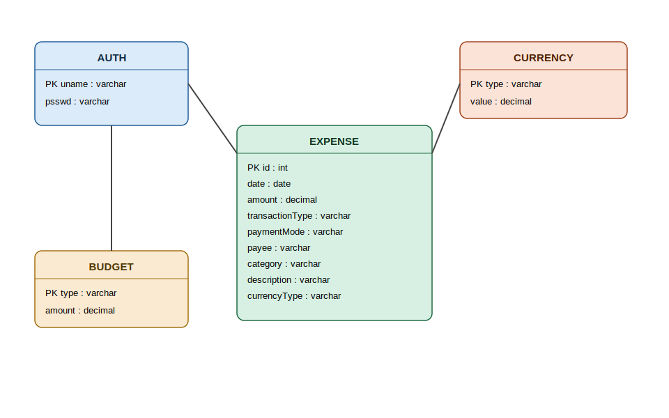
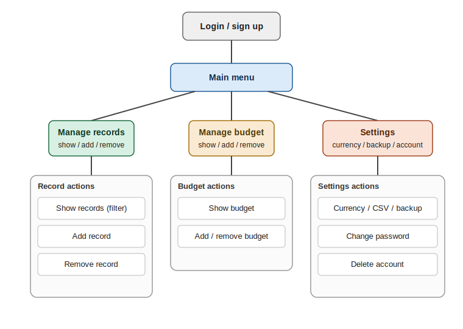

# Expense Tracker

A command-line expense tracker built with Python and MySQL. Built as a school project (CBSE Class XII Computer Science) to practice database design, CRUD operations, and working with an external API for live currency conversion.

The original goal, as written for the school submission: let a user track income and expenses, manage budgets per category, switch between currencies, and back up or restore their data — all from a simple text interface.

## Features

- **User accounts** — simple sign-up/login system (single-user per database)
- **Expense records** — add, search/filter, and delete expenses by payee, category, amount, payment mode, transaction type, or date range
- **Budgets** — set, view, and remove budget limits per category
- **Multi-currency support** — live exchange rates pulled from the [Frankfurter API](https://frankfurter.dev/), with all stored expenses converted when you switch currencies
- **CSV export/import** — export all expense data to CSV, and restore from a backup CSV
- **Auto-setup database** — creates the database and tables automatically on first run if they don't exist

## Tech Stack

- Python 3
- MySQL (via `mysql-connector-python`)
- `python-dotenv` for configuration
- [Frankfurter API](https://frankfurter.dev/) for currency exchange rates

## Database Schema



One `auth` user owns many `expense` records and many `budget` entries. Each `expense` row references a `currency` type for the amount it stores. The original version of this project (built for a school submission) had the database credentials hardcoded directly in the script; this version loads them from environment variables instead — see Setup below.

## CLI Flow



Logging in (or signing up, if no account exists yet) leads to a main menu with three branches — records, budget, and settings — each with their own sub-actions.

## Setup

1. Clone the repo and install dependencies:
   ```bash
   pip install -r requirements.txt
   ```
2. Make sure a MySQL server is running and you have a user with permission to create databases.
3. Copy `.env.example` to `.env` and fill in your own values:
   ```
   DB_HOST=localhost
   DB_USER=your_username
   DB_PASSWORD=your_password
   DB_NAME=expense_tracker
   ```
4. Run it:
   ```bash
   python main.py
   ```

On first run, the app will create the database and tables automatically and prompt you to sign up.

## Project Structure

| File | Responsibility |
|---|---|
| `main.py` | CLI menus and program flow |
| `db.py` | Database connection, table creation, shared state |
| `auth.py` | Login, password change, account deletion |
| `records.py` | Expense record CRUD |
| `budget.py` | Budget CRUD |
| `settings.py` | Currency switching, CSV export/backup/restore |
| `config.py` | Loads DB credentials from `.env` |

## Known Issues

This was a school project written while still learning, and there are things I'd do differently now that I understand them better. Documenting them here rather than hiding them:

- **SQL injection risk.** Most search/filter queries (in `records.py`, `budget.py`) build SQL using f-strings with raw user input, instead of parameterized queries. A few queries elsewhere in the project (e.g. inserts in `budget.py`, `auth.py`) do use parameterized `%s` placeholders correctly — the inconsistency itself is part of the lesson. The fix is to use placeholders everywhere user input touches a query, with no exceptions.
- **Plaintext passwords.** Passwords are stored and compared as plain text in the `auth` table, with no hashing. A real version would hash passwords (e.g. with `bcrypt`) before storing them, and never store or compare them in plaintext.
- **Global mutable state.** The database connection and cursor (`mydb`, `cr`) are set as globals inside `db.py` and imported across every other file. This works for a single-file CLI tool but doesn't scale well — a class-based or dependency-injected approach would be more maintainable.
- **Limited error handling.** Some input validation exists, but a lot of error handling is broad `except Exception` blocks that print a generic message rather than handling specific failure cases.
- **Single-user design.** The `auth` table only ever holds one set of credentials at a time — there's no real multi-user support.

## Planned Improvements

- [ ] Replace all raw SQL string formatting with parameterized queries
- [ ] Hash passwords instead of storing them in plaintext
- [ ] Refactor away from global database state
- [ ] Add proper multi-user support
- [ ] Add automated tests
- [ ] Replace the CLI with a simple web interface

## Why This Is Public

This project reflects what I knew at the time I built it (Python, MySQL, CRUD, basic API integration). I'm currently learning C++ and going deeper into computer fundamentals, Linux, and systems-level programming — this repo is kept as-is to show where I started.